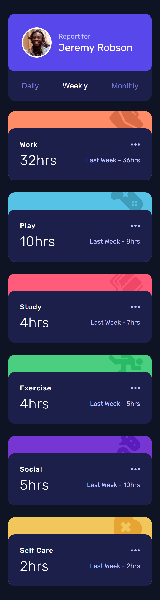
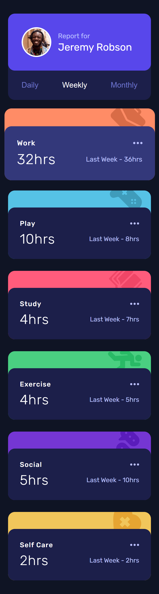
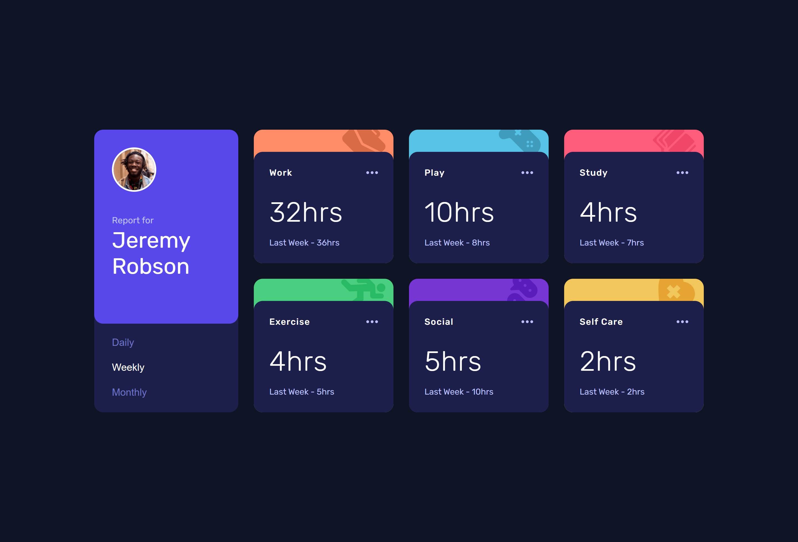
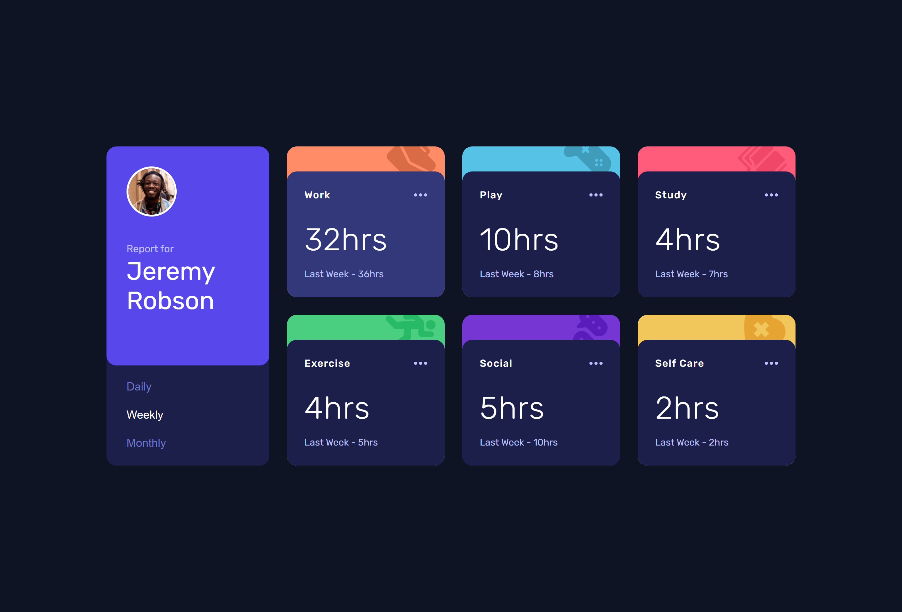

<h1 align="center">
  ❤  <a href="#">Time tracking dashboard</a>
</h1>

<h3 align="center"> 
  👀 Challenge Frontend Mentor
</h3>

  

  

  

  
    
  

<h4 align="center"> 
	🚧 Status: Finished 🚀
</h4>

 <a href="#-about">About</a> •
 <a href="#-layout">Layout</a> • 
 <a href="#-tech-stack">Tech Stack</a> • 
 <a href="#-author">Author</a> • 
 <a href="#-license">License</a>

## 📃 About

-   This was an amazing project to do, I improved my skills with javascript, using asynchronous functions and making HTTP requests with the fetch() method.

-   I also found this amazing **[blog](encr.pw/gPnwz)** by Gabriel Tessarini that explains how to access the properties of an object through square bracket notations and what are the advantages of this method.

---

## 🎨 Layout

### 📱 Mobile

  

  

### 💻 Web

  

  

---

## 🛠 Tech Stack

The following tools were used in the construction of the project:

-   Sass / Scss
-   JavaScript
-   Animation:  **[Animate.css](https://animate.style/)**
-   Font Family:  **[Rubik](https://fonts.google.com/specimen/Rubik)**
---

## 😎 Author

<b>Thiago Moreira</b>

Made with ❤️ by Thiago Moreira 👋🏽 Get in touch!

---

## ⚖ License

This project is under the license [MIT](./LICENSE)
